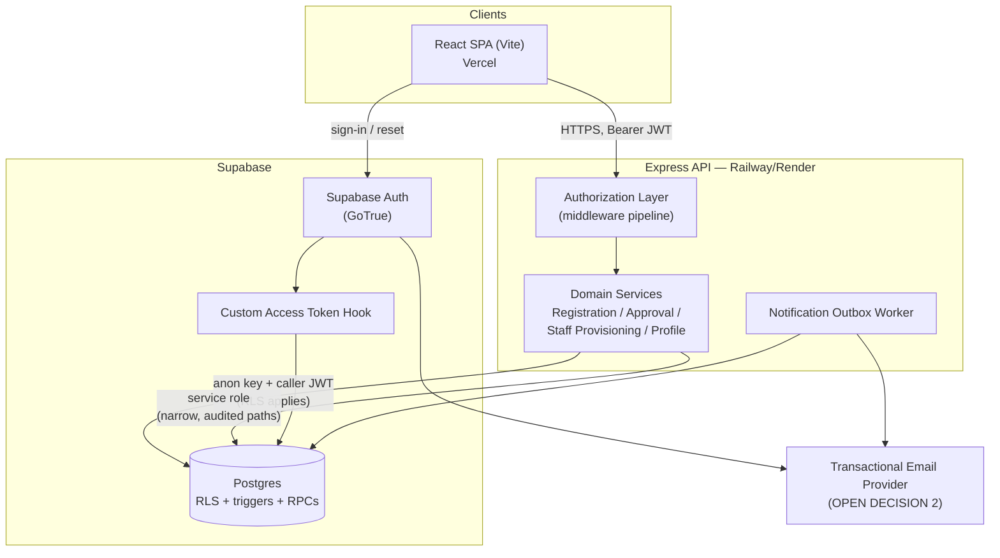
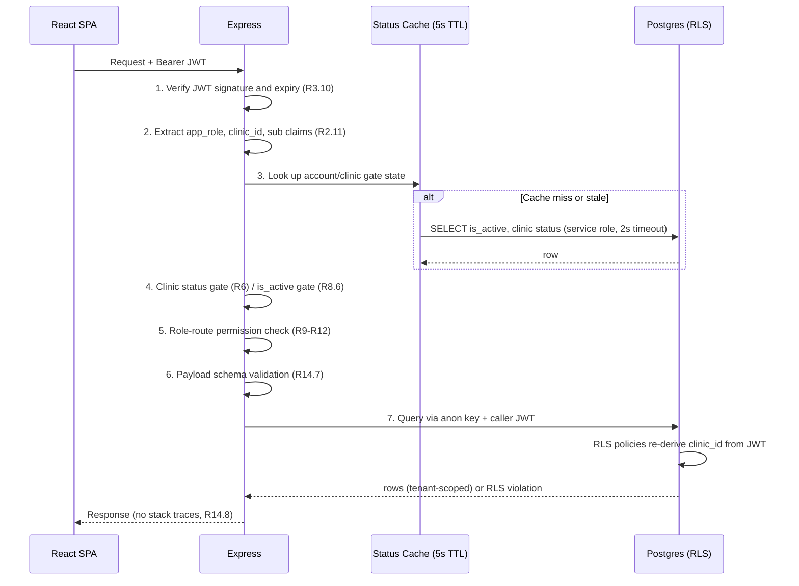
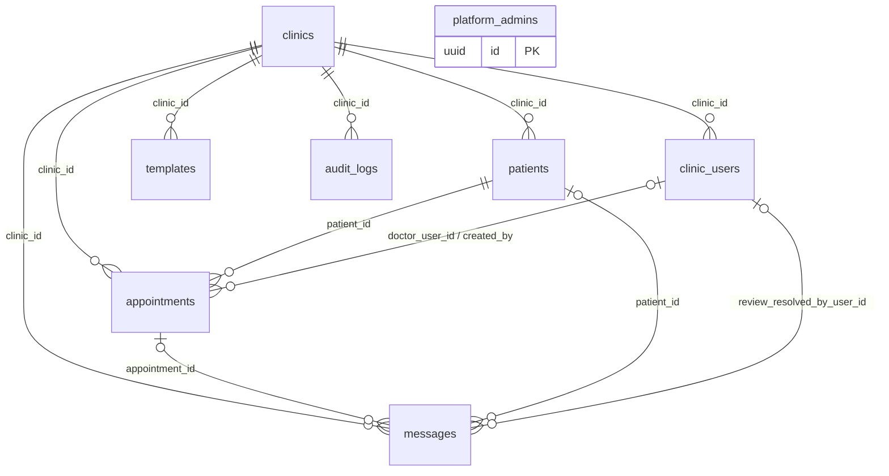
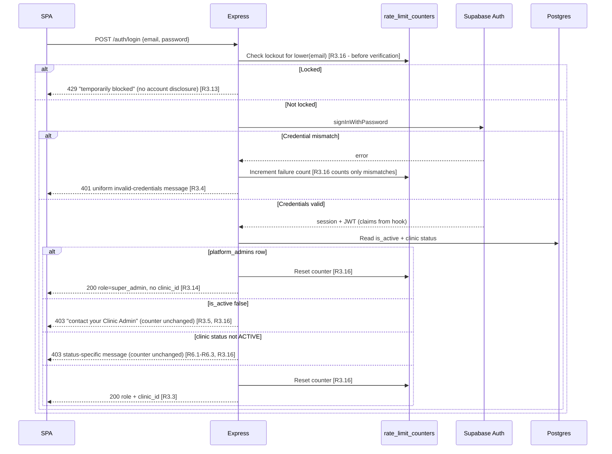
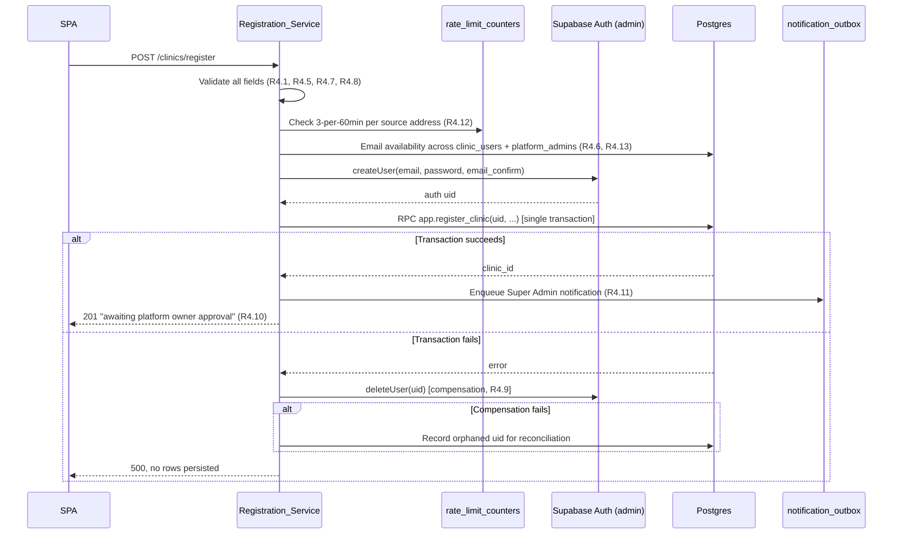

# Design Document

## Introduction

This document is the technical design for **Foundation** of CliniSend PH, implementing the 15 requirements and 12 correctness properties in `requirements.md`. It covers the Supabase schema, Row-Level Security policy set, staff authentication, the authorization layer, the clinic registration and approval lifecycle, clinic profile management, staff provisioning, audit logging, the security baseline, and development seed data.

Scope boundary is unchanged from `requirements.md`: the full baseline schema is created here, but the features that operate on `patients`, `appointments`, `templates`, and `messages` are later phases. The authorization rules for those tables are designed here because Foundation owns the authorization layer that guards them.

Traceability: design sections cite requirement criteria as `R<requirement>.<criterion>` (for example `R2.11`) and correctness properties as `P<n>`.

> **Six open decisions need your input before implementation.** They are collected in [Section 16](#16-open-decisions). Three of them (the transactional email provider, three added platform tables, and the phase-numbering conflict with README Section 22) change what gets built.

---

## 1. Guiding Constraints

These constraints come from the steering conventions and `requirements.md`, and every design choice below is subordinate to them.

| Constraint | Where it is enforced in this design |
|---|---|
| Tenant isolation is enforced by the database, not application code | [Section 5](#5-row-level-security-design) — RLS on every tenant-scoped table, plus `FORCE ROW LEVEL SECURITY` |
| `clinic_id` is never derived from a request path, query, header, or body | [Section 4](#4-identity-claims-and-session-design) — `clinic_id` comes only from a JWT claim minted server-side from a database read |
| Cross-tenant references are structurally impossible | [Section 3.4](#34-composite-foreign-keys-for-tenant-safe-references) — composite foreign keys on `(clinic_id, id)` |
| Privileged actions and their audit rows commit together or not at all | [Section 6](#6-service-designs) — each privileged action is a single `SECURITY DEFINER` Postgres function |
| All timing logic is explicit Philippine Standard Time | [Section 10](#10-timezone-strategy) |
| Fixed stack, no substitutions | React (Vite), Express, Supabase, Vercel + Railway/Render |
| No implementation code in this phase | This document contains illustrative SQL and TypeScript as *design specification*, not deliverable code |

---

## 2. Architecture

### 2.1 System context



### 2.2 Two database access paths

The single most important architectural rule in Foundation is which key the backend uses for a given statement.

| Path | Key | RLS | Used for |
|---|---|---|---|
| **Tenant path** (default) | Supabase anon key + the caller's JWT forwarded as `Authorization` | Applies | Every read and write on behalf of an authenticated staff user |
| **Privileged path** (exception) | Supabase service role key | Bypassed | Only: the auth-hook read, pre-authentication lookups (login rate limiting), the registration transaction, `platform_admins` seeding, the notification outbox, and session revocation |

Every privileged-path call site is enumerated in [Section 12.2](#122-service-role-key-containment) and must be justified there. Adding a call site is a design change, not an implementation detail. This is what makes `R2.10` auditable rather than aspirational.

The tenant path is what makes `P1` (tenant isolation) hold even if a service or middleware has a bug: the backend forwarding a caller's JWT means Postgres re-derives `clinic_id` from the token independently of anything the Express code believes.

### 2.3 Request lifecycle



Steps 4 and 5 are deliberately redundant with the RLS policies in step 7. Defense in depth is the point: RLS is the guarantee, the middleware is the fast, well-worded rejection.

### 2.4 Middleware pipeline

Order matters and is fixed:

1. `httpsRedirect` — `R14.2`
2. `securityHeaders` — HSTS, `X-Content-Type-Options`, `X-Frame-Options`, `Referrer-Policy` (`R14.13`)
3. `cors` — exact origin allowlist, no wildcard (`R14.12`)
4. `requestId` + structured logging (secret-redacting)
5. `rateLimit` — route-specific (`R3.13`, `R4.12`, `R8.15`)
6. `authenticate` — JWT verification, claim extraction (`R3`)
7. `gateAccountAndClinic` — `is_active` and clinic `status` (`R6`, `R8.6`)
8. `authorize(role, action)` — permission matrix (`R9`–`R12`)
9. `validate(schema)` — must run before any database access code (`R14.7`)
10. route handler → domain service
11. `errorHandler` — uniform shape, no internals (`R14.8`)

Middleware 6 runs before 7 so that an unauthenticated request never reveals clinic state. Middleware 5 runs before 6 so that lockout is evaluated before credential verification (`R3.16`).

---

## 3. Data Model

### 3.1 Entity relationships



`platform_admins` is intentionally unrelated to `clinics`: a Super Admin has no `clinic_id` (`R2.11`, `R3.14`).

`audit_logs.actor_user_id` carries no foreign key (`R1.25`) because it holds either a `platform_admins` id or a `clinic_users` id.

### 3.2 Table designs

Column lists, nullability, lengths, defaults, and check constraints are specified exhaustively in `R1.2`–`R1.16` and `R1.21`–`R1.25`. This section records the design decisions layered on top of that specification rather than restating it.

| Table | Design notes |
|---|---|
| `platform_admins` | `id` is the Supabase Auth uid of the seeded Super Admin (`R1.2`). No generated default on `id`, because the value must equal an existing `auth.users.id`. RLS enabled with a read-own policy and **no** insert/update/delete policy, so `R9.8` (seed-only creation) is enforced by the database, not only by the absence of a route. |
| `clinics` | `status` defaults to `PENDING_APPROVAL` (`R1.3`, `R4.2`); `default_reminder_hours_before` defaults to `24` (`R1.3`, `R4.4`, `R7.3`). `sender_name` is nullable at the schema level but constrained to the 1–11 alphanumeric-with-at-least-one-letter rule on write (`R7.4`). |
| `clinic_users` | `id` equals the Supabase Auth uid (`R1.4`). Case-insensitive unique email via a unique index on `lower(email)` (`R1.18`). `role` is immutable after insert, enforced by trigger (`R8.14`). |
| `patients` | Unique `(clinic_id, mobile_number)` (`R1.5`) — the same number may exist at two clinics, which is the cross-clinic edge case the README flags for Phase 17. `mobile_number` normalized to the 11-digit `09` form before the check constraint sees it. |
| `appointments` | `appointment_date` is `date` and `appointment_time` is `time` — deliberately **not** `timestamptz` (`R1.6`, see [Section 10](#10-timezone-strategy)). `updated_at` maintained by trigger. |
| `templates` | Unique `(clinic_id, name)` (`R1.7`). Created empty in Foundation; content is Phase 14. |
| `messages` | `appointment_id` and `patient_id` nullable so an unmatched inbound message persists (`R1.8`) — required by the Phase 16 ambiguity queue. `cost` as `numeric(6,2)` with a 0.00–9999.99 check. |
| `audit_logs` | `clinic_id` is NOT NULL (`R1.12`), which is a deliberate divergence from README Section 19 (`clinic_id` nullable for platform-level events). Append-only, enforced by trigger plus policy absence (`R13.7`). |

Every tenant-scoped table gets a `clinic_id` index (`R1.17`). Foreign keys use `ON DELETE RESTRICT` throughout (`R1.10`), which is what makes `P12` (referential retention) a database guarantee rather than an application check.

### 3.3 Enumerated values

Implemented as `CHECK` constraints rather than Postgres `ENUM` types, because a check constraint can be altered in a forward migration without the `ALTER TYPE` restrictions that would complicate later phases adding a status value.

- `clinics.status` — 4 values (`R1.13`)
- `clinic_users.role` — 3 values (`R1.14`)
- `appointments.status` — 7 values (`R1.15`)
- `messages.direction` — 2, `messages.status` — 4 (`R1.16`)
- `audit_logs.action` — 8, `audit_logs.target_table` — 2 (`R1.24`)

### 3.4 Composite foreign keys for tenant-safe references

`R12.12` requires rejecting an `appointments` or `messages` write whose `patient_id`, `appointment_id`, or `doctor_user_id` points at a row in a different clinic. A trigger could check this, but a composite foreign key makes it structurally impossible.

```sql
-- Parent side: a redundant-looking unique key that enables the composite reference
alter table public.patients      add constraint patients_clinic_id_id_key      unique (clinic_id, id);
alter table public.clinic_users  add constraint clinic_users_clinic_id_id_key  unique (clinic_id, id);
alter table public.appointments  add constraint appointments_clinic_id_id_key  unique (clinic_id, id);

-- Child side: the reference carries clinic_id, so a cross-tenant pair has no parent row
alter table public.appointments
  add constraint appointments_patient_fk
  foreign key (clinic_id, patient_id) references public.patients (clinic_id, id)
  on delete restrict;

alter table public.appointments
  add constraint appointments_doctor_fk
  foreign key (clinic_id, doctor_user_id) references public.clinic_users (clinic_id, id)
  on delete restrict;
```

The same pattern applies to `appointments.created_by`, `messages.appointment_id`, `messages.patient_id`, and `messages.review_resolved_by_user_id`. A cross-tenant reference now fails on a foreign key violation with no policy, trigger, or application check involved, which is the strongest available form of `R12.12`.

### 3.5 Supporting platform tables

Five requirements need durable state that no table in `R1.1` provides. These are **OPEN DECISION 3** — they are additions beyond the enumerated schema and need your approval.

| Table | Serves | Why it cannot be avoided |
|---|---|---|
| `rate_limit_counters` | `R3.13`, `R3.16`, `R4.12`, `R8.15` | Login lockout must be evaluated *before* credential verification and must survive a backend restart. In-process counters fail on restart and on a second instance. |
| `staff_invitations` | `R8.2`, `R8.3`, `R8.4`, `R8.8`, `R8.15` | 72-hour expiry, single use, invalidation of prior links, and a 5-per-hour resend cap need per-invitation state that Supabase's built-in invite flow does not expose. |
| `notification_outbox` | `R4.11`, `R4.14`, `R5.6`, `R5.7`, `R5.13`, `R7.12` | `R5.13` requires 3 retries within 15 minutes and a persisted delivery-failure indication surfaced to the Super Admin. That is queue state. |

`rate_limit_counters` is keyed on `(scope, subject_key)` where `subject_key` is a normalized email, a source address, or a `clinic_users` id depending on scope. All three tables are platform-level, not tenant-scoped: RLS is enabled with **no** policies for `authenticated`, making them reachable only on the privileged path.

Two smaller notes:

- The migration version registry (`R1.23`) is the Supabase CLI's `supabase_migrations.schema_migrations` table. No custom table needed.
- Session revocation (`R5.4`, `R8.6`) needs no table; see [Section 6.6](#66-session-termination).

---

## 4. Identity, Claims, and Session Design

### 4.1 Claims minted by a Custom Access Token Hook

`R2.2`, `R2.3`, and `R2.13` require RLS policies to read `clinic_id` from the session token. Supabase supports this through a [Custom Access Token Hook](https://supabase.com/docs/guides/auth/auth-hooks/custom-access-token-hook), a Postgres function that runs before a token is issued and can add claims used by RLS policies, as described in [Supabase's custom claims and RBAC guide](https://supabase.com/docs/guides/database/postgres/custom-claims-and-role-based-access-control-rbac). Content was rephrased for compliance with licensing restrictions.

The hook reads `clinic_users` and `platform_admins` and injects:

| Claim | Value | Notes |
|---|---|---|
| `app_role` | `super_admin` \| `admin` \| `doctor` \| `receptionist` | **Not** named `role`. Supabase already uses the `role` claim for the Postgres role (`authenticated`), and overwriting it would break database access. |
| `clinic_id` | the user's `clinic_id`, or absent for a Super Admin | Absent, not null, for Super Admin (`R3.14`) |

A staff user present in neither table receives neither claim, which makes them indistinguishable from an anonymous session at the RLS layer (`R2.13`).

### 4.2 What is a claim, and what is a live read

This split is the crux of the authorization design.

| Fact | Source | Rationale |
|---|---|---|
| `clinic_id` | JWT claim | Immutable for the lifetime of an account. Safe to cache in a token. |
| `app_role` | JWT claim | Immutable — `R8.14` forbids role changes outright, so the claim cannot go stale. |
| `clinic_users.is_active` | Live read, ≤5s cache | Mutable. `R8.6` demands blocking within 60s. |
| `clinics.status` | Live read, ≤5s cache | Mutable. `R6.6` allows 30s; `R5.4` demands 5s. |

Because `role` and `clinic_id` are immutable by design, the well-known staleness hazard of JWT-embedded authorization data does not apply to them. Only the two mutable gates need live reads, and both are satisfied by one query.

### 4.3 The gate cache

A single lookup per request serves both gates:

```sql
select cu.is_active, c.status
from public.clinic_users cu
join public.clinics c on c.id = cu.clinic_id
where cu.id = $1;
```

Cached in-process for **5 seconds**, keyed on the user id, with a 2-second statement timeout that fails closed to HTTP 403 (`R6.9`).

The 5-second TTL is chosen by the tightest requirement, not the loosest: `R5.4` requires suspension to terminate access within 5 seconds, while `R6.6` permits 30. Choosing 5 satisfies both. Cost is at most one lightweight indexed lookup per user per 5 seconds. This is **OPEN DECISION 5** only in the sense that the tradeoff is worth your acknowledgment; the value follows from the requirements.

The service performing a suspension invalidates its own cache entry synchronously, so a single-instance deployment blocks immediately rather than after 5 seconds.

### 4.4 Session lifetime

`R3.10` requires a 12-hour absolute session lifetime and a 60-minute inactivity expiry. Supabase Auth supports both natively — [session lifetime can be limited by configuration](https://supabase.com/docs/guides/auth/sessions), via the `GOTRUE_SESSIONS_TIMEBOX` and `GOTRUE_SESSIONS_INACTIVITY_TIMEOUT` settings, which take Go duration strings. Content was rephrased for compliance with licensing restrictions.

| Setting | Value | Requirement |
|---|---|---|
| Session timebox | `12h` | `R3.10` |
| Session inactivity timeout | `60m` | `R3.10`, `R3.15` |
| JWT (access token) expiry | `30m` | Bounds the window a revoked refresh token's access token stays syntactically valid |

Using the platform's own session controls rather than hand-rolled tracking means `R3.15` (refresh restarts inactivity, leaves the 12-hour cap intact) is the provider's behavior instead of our arithmetic.

### 4.5 Login flow, including lockout ordering



Two subtleties `R3.16` makes explicit and this flow honors: a rejection caused by clinic status or `is_active` does **not** increment the failure counter, and lockout is checked before both credential verification and the status gate. A session established but then rejected at the status gate is discarded server-side.

### 4.6 Password reset

Supabase's reset flow, with link expiry configured to 60 minutes (`R3.7`). `R3.8` (identical response for unknown addresses) is Supabase's default behavior. On completion the backend explicitly revokes the account's sessions and outstanding reset links (`R3.9`) — see [Section 6.6](#66-session-termination).

---

## 5. Row-Level Security Design

### 5.1 Helper functions

```sql
create schema if not exists app;

create or replace function app.jwt_clinic_id() returns uuid
language sql stable as $$
  select nullif(current_setting('request.jwt.claims', true)::jsonb ->> 'clinic_id', '')::uuid
$$;

create or replace function app.jwt_app_role() returns text
language sql stable as $$
  select nullif(current_setting('request.jwt.claims', true)::jsonb ->> 'app_role', '')
$$;

create or replace function app.is_super_admin() returns boolean
language sql stable as $$ select app.jwt_app_role() = 'super_admin' $$;
```

`app.jwt_clinic_id()` returns `NULL` for an anonymous session, a Super Admin session, and a malformed token alike. Since `clinic_id = NULL` is never true in SQL, every tenant policy denies by default for all three cases — which is `R2.13` obtained from three-valued logic rather than from an explicit branch.

### 5.2 Enabling RLS

```sql
alter table public.<t> enable row level security;
alter table public.<t> force row level security;
```

Applied to all six tenant-scoped tables (`R2.1`) plus `platform_admins`. `FORCE ROW LEVEL SECURITY` also subjects the table owner to policies, closing the migration-owner gap. Note the limit honestly: a role with the `BYPASSRLS` attribute — which includes Supabase's `service_role` — still bypasses policies. That is precisely why service role key containment (`R2.10`, [Section 12.2](#122-service-role-key-containment)) is load-bearing rather than merely tidy.

### 5.3 Tenant policy pattern

Policies combine the tenant predicate (`R2.2`, `R2.3`) with the role predicate from `R9`–`R12`, so the role matrix is enforced at the database layer too:

```sql
-- patients: read by any staff of the clinic (R10.4, R11.1, R12.1)
create policy patients_select on public.patients
  for select to authenticated
  using (clinic_id = app.jwt_clinic_id());

-- patients: written only by a Receptionist of that clinic (R12.1, R10.9, R11.5, R11.6)
create policy patients_insert on public.patients
  for insert to authenticated
  with check (clinic_id = app.jwt_clinic_id() and app.jwt_app_role() = 'receptionist');

create policy patients_update on public.patients
  for update to authenticated
  using      (clinic_id = app.jwt_clinic_id() and app.jwt_app_role() = 'receptionist')
  with check (clinic_id = app.jwt_clinic_id());

create policy patients_delete on public.patients
  for delete to authenticated
  using (clinic_id = app.jwt_clinic_id() and app.jwt_app_role() = 'receptionist');
```

The `UPDATE` policy's `WITH CHECK` on `clinic_id` is what satisfies `R2.14` and the third clause of `P1`: reassigning a row's `clinic_id` to another clinic fails the check, so no trigger is needed for that case.

There is deliberately **no** `super_admin` clause in any policy on `patients`, `appointments`, `templates`, or `messages`. Default-deny then produces `R2.9` and `R9.6` — a Super Admin read returns zero rows because no policy grants it, including reads reached through a join or an embedded resource (`R9.9`).

### 5.4 Policy matrix

`SA` = Super Admin, `CA` = Clinic Admin, `Dr` = Doctor, `Rc` = Receptionist. `own` = restricted to the caller's `clinic_id`. `—` = no policy, therefore denied.

| Table | SA | CA | Dr | Rc | Requirements |
|---|---|---|---|---|---|
| `clinics` | R all; U `status`, `rejection_reason` only | R own; U profile fields only | R own | R own (subset of fields) | `R9.1`, `R9.7`, `R10.1`, `R12.6` |
| `clinic_users` | R all; U `is_active`→false only | R own; C/U own clinic | R own | — | `R9.5`, `R9.10`, `R10.2`, `R10.4` |
| `patients` | — | R own | R own | CRUD own | `R9.6`, `R10.4`, `R10.9`, `R11.1`, `R12.1` |
| `appointments` | — | R own | R own; U `status` only | CRUD own | `R9.6`, `R10.9`, `R11.2`, `R11.4`, `R12.2` |
| `templates` | — | CRUD own | R own | R own | `R9.6`, `R10.3`, `R11.7`, `R12.6`, `R12.9` |
| `messages` | — | R own | — | C, R own; U review fields only | `R9.6`, `R10.10`, `R11.8`, `R12.3`–`R12.5` |
| `audit_logs` | R all | R own | — | — | `R9.3`, `R10.6`, `R12.8` |
| `platform_admins` | R own row | — | — | — | `R9.8` |

Aggregate counts, per `R2.8` and `R9.4`, are not a row-level grant and appear in [Section 5.7](#57-super-admin-aggregate-counts) instead.

### 5.5 Column-level restrictions need triggers, not policies

Postgres RLS operates on rows, not columns. Column privileges (`GRANT UPDATE (col)`) are granted per database role, and every authenticated Supabase user shares the `authenticated` role, so column grants cannot distinguish a Super Admin from a Clinic Admin. Several requirements are column-scoped:

- `R9.7` — Super Admin may update only `clinics.status` and `rejection_reason`
- `R7.8`, `R10.1` — Clinic Admin may update only the five profile fields
- `R8.14` — `clinic_users.role` is immutable
- `R8.5` — Clinic Admin may change only `is_active` on staff rows

The design uses `BEFORE UPDATE` triggers that compare `OLD` to `NEW` and raise when a column outside the caller's permitted set changed. A trigger can see both tuples; a policy's `WITH CHECK` cannot.

```sql
create or replace function app.guard_clinics_columns() returns trigger
language plpgsql as $$
declare changed text[];
begin
  select array_agg(k) into changed
  from jsonb_each_text(to_jsonb(old)) o(k, v)
  join jsonb_each_text(to_jsonb(new)) n(k2, v2) on o.k = n.k2
  where coalesce(o.v, '') <> coalesce(n.v2, '');

  if changed is null then return new; end if;

  if app.is_super_admin() then
    if changed <@ array['status','rejection_reason'] then return new; end if;
    raise exception 'SUPER_ADMIN_COLUMN_FORBIDDEN' using errcode = '42501';
  end if;

  if app.jwt_app_role() = 'admin' and old.id = app.jwt_clinic_id() then
    if changed <@ array['name','contact_email','contact_phone',
                        'default_reminder_hours_before','sender_name'] then
      return new;
    end if;
  end if;

  raise exception 'CLINIC_COLUMN_FORBIDDEN' using errcode = '42501';
end $$;
```

### 5.6 Trigger inventory

| Trigger | Table | Timing | Enforces |
|---|---|---|---|
| `guard_clinics_columns` | `clinics` | BEFORE UPDATE | `R7.8`, `R9.7`, `R10.1` |
| `guard_clinic_users_immutable` | `clinic_users` | BEFORE UPDATE | `R8.14` (`role`, `clinic_id`, `id` immutable) |
| `guard_clinic_users_scope` | `clinic_users` | BEFORE UPDATE | `R8.5`, `R8.11` (`is_active` only; not own row), `R9.5` |
| `guard_last_active_admin` | `clinic_users` | BEFORE UPDATE | `R8.16` (an ACTIVE clinic retains ≥1 active admin) |
| `audit_logs_append_only` | `audit_logs` | BEFORE UPDATE OR DELETE | `R13.7` — raises unconditionally, including for `service_role` |
| `guard_appointment_status` | `appointments` | BEFORE UPDATE | `R11.2`, `R11.3`, `R11.10`–`R11.12`, `R12.13` |
| `set_updated_at` | `appointments` | BEFORE UPDATE | `R11.11` |
| `normalize_mobile_number` | `patients` | BEFORE INSERT OR UPDATE | `R1.5` normalization to the `09` form |

`audit_logs_append_only` deserves a note. `R13.7` requires that no update or delete reach `audit_logs` even through the service role key. Because a `BYPASSRLS` role ignores policies but **not** triggers, the trigger is the only mechanism that actually delivers this. Migrations that must restructure the table use an explicit, reviewed `ALTER TABLE ... DISABLE TRIGGER` step — the documented exception `R13.7` carves out for the Migration_System.

`guard_appointment_status` carries the appointment rules that make `P11` hold: a Doctor may set only `Completed` or `No-show`, only from a non-terminal status, changing only `status` and `updated_at`; a Receptionist may not set `Reminder Sent` (`R12.13`); and `No-show` requires `app_role` in (`doctor`, `receptionist`), so no automated process can ever set it (`R11.12`). Foundation ships the guard even though appointment editing is Phase 13, because the constraint belongs with the schema.

### 5.7 Super Admin aggregate counts

`R9.4` and `R2.8` require the Super Admin to read per-clinic counts of `clinic_users`, `patients`, `appointments`, and `messages` rows, while `R9.6` and `R9.9` forbid any row or column value from those tables reaching a Super Admin. A view would inherit the caller's policies and return zeros. The resolution is a narrowly scoped `SECURITY DEFINER` function that returns only integers:

```sql
create or replace function app.platform_clinic_counts()
returns table (clinic_id uuid, users_count bigint, patients_count bigint,
               appointments_count bigint, messages_count bigint)
language plpgsql security definer set search_path = public, app as $$
begin
  if not app.is_super_admin() then
    raise exception 'FORBIDDEN' using errcode = '42501';
  end if;

  return query
  select c.id,
         (select count(*) from clinic_users  where clinic_id = c.id),
         (select count(*) from patients      where clinic_id = c.id),
         (select count(*) from appointments  where clinic_id = c.id),
         (select count(*) from messages      where clinic_id = c.id)
  from clinics c;
end $$;
```

This is a deliberate, audited RLS bypass. Its safety rests on three properties: it takes no arguments, so there is no injection surface; it returns only `bigint` counts and `clinics.id`, never an id or column from a restricted table (`R9.4`); and it self-checks the caller's claim before doing anything. `EXECUTE` is granted to `authenticated` and revoked from `anon`. Counts return `0` rather than absent rows for clinics with no data, per `R9.4`. This is **OPEN DECISION 6**.

### 5.8 The negative control

README Phase 9's gate requires that the isolation harness fail when a policy is deliberately dropped. The design therefore includes a test mode that drops one named policy, asserts the harness reports a leak, and restores it. A harness that cannot detect a leak is not evidence of isolation, so this control is part of the deliverable rather than an optional extra.

---

## 6. Service Designs

### 6.1 Atomicity strategy

`R4.9`, `R13.8`, and `P6`/`P7` require that a privileged action and its audit row commit together. Supabase's REST interface issues each statement in its own transaction, so multi-statement atomicity is achieved by implementing each privileged action as a single `plpgsql` function invoked as one RPC call. One call, one transaction, one commit.

| Action | Function | Atomic unit |
|---|---|---|
| Clinic registration | `app.register_clinic(...)` | `clinics` + `clinic_users` + `audit_logs` |
| Status change | `app.set_clinic_status(...)` | `clinics.status` + `audit_logs` |
| Staff creation | `app.create_staff_user(...)` | `clinic_users` + `staff_invitations` + `audit_logs` |
| Staff activation change | `app.set_staff_active(...)` | `clinic_users.is_active` + `audit_logs` |

### 6.2 Registration: a saga, because Auth is not in the transaction

Creating a Supabase Auth user is an HTTP call to GoTrue, not a statement in our transaction. `clinic_users.id` must equal the Auth uid (`R1.4`), which forces the Auth user to exist first. So a pure transaction is impossible and the design uses a compensating action.



Three points of care:

**Validation precedes user creation.** `R4.8` requires that an out-of-range password create no Auth user at all, so password length is checked before the GoTrue call, not delegated to it.

**Compensation can itself fail.** If `deleteUser` fails, an Auth user exists with no `clinic_users` row. That user cannot log in — `R3.3` requires a matching `clinic_users` row — so the security posture holds, but the email address is silently occupied. The design records the orphaned uid and a reconciliation sweep clears it. `P7`'s injected-failure test must cover this branch specifically.

**Duplicate clinic names are allowed.** `R4.2` is explicit that a registration succeeds even when the clinic name or contact email matches an existing clinic. Only *account* emails must be unique. It would be easy to add a well-meaning uniqueness check here and violate the requirement.

**Notification failure does not roll back.** `R4.14` requires the clinic to survive a failed Super Admin notification, which contrasts with `R13.8` where a failed audit write *must* roll back. The outbox enqueue is inside the transaction; delivery is not.

### 6.3 Approval lifecycle

`app.set_clinic_status(p_clinic_id, p_target, p_reason)` runs as one transaction:

1. `select ... from clinics where id = p_clinic_id for update` — the row lock is what makes `R5.12` and `P5` hold under concurrency. Simultaneous requests serialize; the second evaluates against the first's committed result.
2. Clinic missing → error (`R5.8`).
3. Target equals current status → return a no-op result, write no audit row, enqueue no notification (`R5.11`). Distinguished in the return value from an applied change so the API can report it.
4. Transition not in the permitted set → error naming the current status and the permitted targets (`R5.8`). Permitted set (`P5`): `PENDING_APPROVAL→ACTIVE`, `PENDING_APPROVAL→REJECTED`, `ACTIVE→SUSPENDED`, `SUSPENDED→ACTIVE`.
5. Rejection reason longer than 500 characters → error (`R5.8`).
6. Update `status`, and `rejection_reason` on a rejection (`R5.3`).
7. Insert the `audit_logs` row with the action matching the transition (`R13.1`).
8. Enqueue the notification (`R5.6`, `R5.7`).

After commit, the service revokes sessions on a suspension (`R5.4`) and invalidates its gate cache. Rows are always retained on suspension and rejection (`R5.10`) — `ON DELETE RESTRICT` plus the absence of any delete path make this structural.

The clinic list (`R5.1`) is a paginated read: filterable by any subset of the four statuses, sorted `created_at` descending, default page size 25, caller-selectable 10–100, timestamps rendered in PHT.

### 6.4 Staff provisioning and invitations

Creation (`app.create_staff_user`) inserts the `clinic_users` row with `is_active = true`, the `staff_invitations` row, and the audit row in one transaction, after the Auth user is created with the same saga and compensation as registration. `role` is constrained to `doctor` or `receptionist` (`R8.1`, `R10.11`), and any attempt to create an `admin` is rejected before the Auth call (`R8.14`).

The invitation is a platform-issued token rather than Supabase's built-in invite, because Foundation needs control the built-in flow does not offer:

| Requirement | Mechanism |
|---|---|
| 72-hour expiry (`R8.3`) | `staff_invitations.expires_at` |
| Single use (`R8.4`) | `consumed_at` set on redemption |
| Resend invalidates prior links (`R8.15`) | `superseded_at` on all prior rows for that account |
| Max 5 resends per 60 minutes (`R8.15`) | `rate_limit_counters` scope `invite_resend` |
| Reactivation reissues if never set up (`R8.8`) | Conditional on the absence of a consumed invitation |

Tokens are stored as hashes, never in plaintext, and the plaintext appears only in the emailed link. Redemption sets the password through the Auth admin API and marks the invitation consumed.

Deactivation is guarded on four fronts: a Clinic Admin cannot deactivate their own account (`R8.11`), cannot deactivate the last active admin of an ACTIVE clinic (`R8.16`), cannot touch another clinic's rows (`R8.10`), and cannot change any column but `is_active` (`R8.5`). Deactivation preserves history — the `clinic_users` row, its audit rows, and every `appointments.doctor_user_id` reference stay intact (`R8.7`), which `ON DELETE RESTRICT` guarantees.

The Super Admin may set `is_active` to false on any staff row but never to true (`R9.5`), enforced by the policy's `WITH CHECK (is_active = false)` and re-checked in `guard_clinic_users_scope`.

### 6.5 Clinic profile

A partial update: submitted fields are applied and omitted fields are untouched (`R7.10`), but validation is all-or-nothing — if any field fails, the entire update is rejected and no field persists (`R7.11`). This combination means the service validates the merged result, then writes once.

Field rules: `name` 2–100 characters after trimming; `contact_email` at most 254 characters with exactly one `@` and non-empty parts on both sides (`R7.1`); `default_reminder_hours_before` an integer 1–168 (`R7.2`, `R7.5`); `sender_name` 1–11 alphanumeric characters with at least one letter (`R7.4`, `R7.6`); `contact_phone` the 11-digit `09` or `+639` form (`R7.7`). A `contact_email` change notifies both the former and the new address (`R7.12`), which requires reading the old value before writing.

Note the `name` length asymmetry: the schema allows 1–120 characters (`R1.3`) while the API constrains 2–100 (`R7.1`). The wider schema bound is deliberate headroom; the API is the narrower gate.

### 6.6 Session termination

"Terminate sessions" appears in `R3.9`, `R5.4`, `R6.7`, `R8.6`, and `R8.13` with deadlines from 5 to 60 seconds. Two mechanisms combine:

1. **Revoke refresh tokens** — delete the user's rows from `auth.sessions` on the privileged path. The session cannot be renewed.
2. **Reject at the gate** — the ≤5s gate cache ([Section 4.3](#43-the-gate-cache)) blocks requests bearing an already-issued access token, and returns 403 while terminating the session (`R6.7`) without waiting for the `R3.10` expiry.

Mechanism 1 alone is insufficient because an unexpired access token would keep working; mechanism 2 alone is insufficient because a refresh token would keep minting new ones. Together they bound the exposure window at the cache TTL, which is why the TTL is set by `R5.4`'s 5-second requirement.

### 6.7 Audit logger

Audit rows are written inside the same function as the action they record (`R13.8`), so `P6` — one audit row per successful privileged action — is a transactional consequence rather than a convention. `clinic_id` is always the affected clinic (`R13.6`), which is why `audit_logs.clinic_id` can be NOT NULL (`R1.12`). `actor_user_id` holds a `platform_admins` id for Super Admin actions and a `clinic_users` id otherwise, with no foreign key (`R13.10`, `R1.25`).

Registration is the interesting case: the actor is the Clinic Admin row created by that same registration (`R13.4`), so the insert order within the transaction is `clinics`, then `clinic_users`, then `audit_logs`.

Passwords, hashes, and reset tokens never enter an audit row (`R13.9`) — the functions write only the seven specified columns, and none of them carries a payload blob, so there is nowhere for a secret to hide.

### 6.8 Notification outbox

Rows carry `status`, `attempt_count`, `next_attempt_at`, and `last_error`. A worker claims work with `SELECT ... FOR UPDATE SKIP LOCKED`, which makes concurrent or restarted workers safe. Up to 3 attempts within 15 minutes; after the final failure the row is marked `failed` and surfaces in the Super Admin view as a delivery-failure indication (`R5.13`). The status change and its audit row are never rolled back for a delivery failure.

Durability comes from the state living in Postgres, so a backend restart resumes rather than loses work. `pg_cron` is the alternative trigger and the mandated mechanism for the Phase 15 reminder scheduler; for Foundation's outbox, a DB-backed worker is sufficient and simpler.

### 6.9 Migration system

Supabase CLI migrations, applied in ascending version order, recorded in `supabase_migrations.schema_migrations` (`R1.23`). Each migration runs inside a single transaction so a mid-migration failure rolls back entirely and registers no version (`R1.20`). Already-recorded versions are skipped with a success indication (`R1.19`). DDL is written idempotently (`IF NOT EXISTS`, `CREATE OR REPLACE`, guarded `DO` blocks) so `P9` holds: applying the set twice yields the same schema and registry state as applying it once.

### 6.10 Seed routine

Environment-gated: the environment comes solely from a runtime variable, and seeding runs only for local or staging (`R15.4`). Production or an unset value is rejected with the detected environment named (`R15.5`). Every seeded password comes from its own env var, validated 12–72 characters before anything is created (`R15.6`).

Contents on a clean database: one `platform_admins` row; `Demo Clinic` (ACTIVE) with admin, doctor, and receptionist (`R15.1`); `Demo Clinic Two` (ACTIVE) with the same three roles (`R15.7`); and `Pending Demo Clinic` (PENDING_APPROVAL) with an admin (`R15.2`).

Two clinics exist so tenant-isolation tests have a genuine counterparty, and the pending clinic exists so the `R6` status gate is testable without mutating an active clinic.

Idempotence: if any of the three clinic names or any seeded email already exists, the routine creates nothing, changes nothing, and reports success (`R15.3`). Any failure rolls back every row that invocation created, including compensating deletion of Auth users (`R15.8`).

---

## 7. API Surface

All routes are prefixed `/api/v1`. `SA` = Super Admin, `CA` = Clinic Admin, `Dr` = Doctor, `Rc` = Receptionist.

| Method | Path | Access | Requirements |
|---|---|---|---|
| `POST` | `/auth/login` | public | `R3.1`–`R3.5`, `R3.13`, `R3.14`, `R6.1`–`R6.3` |
| `POST` | `/auth/logout` | any staff | `R3.11` |
| `POST` | `/auth/password-reset/request` | public | `R3.7`, `R3.8` |
| `POST` | `/auth/password-reset/confirm` | public + token | `R3.7`, `R3.9` |
| `POST` | `/clinics/register` | public | `R4` (all) |
| `GET` | `/clinics` | SA | `R5.1`, `R9.1` |
| `PATCH` | `/clinics/:id/status` | SA | `R5.2`–`R5.13`, `R9.2` |
| `GET` | `/platform/usage` | SA | `R9.4`, `R2.8` |
| `GET` | `/me/clinic` | CA, Dr, Rc | `R10.1`, `R12.6` |
| `PATCH` | `/me/clinic` | CA | `R7`, `R10.1` |
| `GET` | `/staff` | SA, CA | `R9.10`, `R10.4` |
| `POST` | `/staff` | CA | `R8.1`, `R8.2`, `R8.9`, `R10.11` |
| `PATCH` | `/staff/:id/active` | SA, CA | `R8.5`–`R8.8`, `R8.11`, `R8.13`, `R8.16`, `R9.5` |
| `POST` | `/staff/:id/invitation/resend` | CA | `R8.15` |
| `POST` | `/invitations/:token/accept` | public + token | `R8.4` |
| `GET` | `/audit-logs` | SA, CA | `R9.3`, `R10.6`, `R12.8` |
| `GET` | `/health` | public | README Phase 8 gate |

`:id` in these paths identifies the *target resource*, never the tenant. `clinic_id` is always taken from the session claim (`R2.11`); a request whose supplied `clinic_id` differs from the claim is rejected with 403 (`R2.12`).

`/health` returns liveness and migration-version information only, with no tenant data and no configuration values.

---

## 8. Error Handling

Uniform response shape, with no stack traces, SQL text, or database identifiers (`R14.8`):

```json
{ "error": { "code": "VALIDATION_FAILED", "message": "...", "fields": { "sender_name": "..." } } }
```

| Status | Used for |
|---|---|
| 400 | Schema validation failure, with each failing field named (`R14.7`) |
| 401 | Absent, malformed, or expired session; uniform invalid-credentials message (`R3.4`, `R3.10`) |
| 403 | Role denial, cross-tenant attempt, clinic status gate, deactivated account, unresolvable authorization (`R6`, `R9`–`R12`) |
| 404 | Target resource absent within the caller's tenant |
| 409 | Email unavailable (`R4.6`, `R8.9`); invalid status transition (`R5.8`) |
| 422 | Semantically invalid domain transition, such as a Doctor status update (`R11.3`, `R11.10`) |
| 429 | Login lockout, registration cap, invitation resend cap (`R3.13`, `R4.12`, `R8.15`) |
| 500 | Unexpected failure, after rollback |

Two deliberate choices. A cross-tenant read returns 403 rather than 404 because RLS returns zero rows and the backend cannot distinguish "absent" from "another tenant's" without a privileged read — and performing that read to improve an error message would itself be a leak. Separately, an RLS violation surfacing from Postgres is mapped to 403 with a generic message; the underlying error text is logged server-side, never returned.

---

## 9. Frontend Design

A single React (Vite) SPA with role-based routing. The four staff dashboards are shells in Foundation — the views that fill them arrive in Phase 13 onward.

| Route group | Roles | Foundation content |
|---|---|---|
| `/login`, `/reset-password` | public | Auth forms |
| `/register-clinic` | public | Registration form with client-side mirrors of the `R4` rules |
| `/invitations/:token` | public | Credential-setting form |
| `/admin/*` | SA | Clinic list, approval actions, platform usage counts |
| `/clinic/*` | CA | Clinic profile, staff management |
| `/schedule/*` | Dr | Dashboard shell |
| `/desk/*` | Rc | Dashboard shell |

The role that drives routing comes from the authenticated session, never from client state, so a tampered local value changes what is drawn but not what the API or database will permit. Client-side validation duplicates server rules for feedback only; the server is authoritative.

The client bundle receives only the Supabase project URL and anon key (`R14.5`). Accessibility baseline: labelled inputs, visible focus, validation messages tied to fields via `aria-describedby`, and error summaries announced through a live region.

---

## 10. Timezone Strategy

| Value | Type | Rationale |
|---|---|---|
| `created_at`, `updated_at`, `review_resolved_at` | `timestamptz` | Absolute instants (`R1.22`) |
| `appointment_date` | `date` | A clinic's calendar date is a local concept, not an instant |
| `appointment_time` | `time` | Interpreted as PHT (`R1.6`) |

Rendering always converts explicitly: `created_at at time zone 'Asia/Manila'`. The host's default timezone is never consulted, in the database, the backend, or the client (`R14.11`), which is what makes `P10` hold under a changed host timezone.

Keeping `appointment_date` and `appointment_time` separate rather than folding them into a `timestamptz` is a decision with consequences for Phase 15: the scheduler will compute the reminder instant as `(appointment_date + appointment_time) at time zone 'Asia/Manila' - interval 'N hours'`. Storing an instant instead would be more convenient for that query but would misrepresent an appointment, which is genuinely a local date and wall-clock time, not a point on a global timeline.

One honest note on wording, raised as **OPEN DECISION 4**: `R7.9` and `R13.5` say timestamps are stored "with an explicit UTC+8 offset." A Postgres `timestamptz` does not store an offset — it stores an instant, normalized to UTC, and renders in whatever zone you ask for. The design satisfies the *intent* (never ambiguous, never host-dependent, always rendered in PHT) but not the literal wording. I recommend restating those criteria as "stored as an absolute instant and rendered in Philippine Standard Time."

---

## 11. Correctness Property Implementation

| Property | Primary enforcement | Test approach |
|---|---|---|
| `P1` Tenant isolation | RLS `USING` + `WITH CHECK` on `clinic_id`; `NULL` claim denies by default | Property test across generated clinic pairs, each role, anon key, and `clinic_id` reassignment attempts, plus the [negative control](#58-the-negative-control) |
| `P2` Write scoping | `WITH CHECK (clinic_id = app.jwt_clinic_id())` | Generated payloads carrying arbitrary `clinic_id` values |
| `P3` Status gates access | `gateAccountAndClinic` middleware + ≤5s cache | All four statuses × all clinic-scoped roles |
| `P4` Role matrix completeness | Policy matrix ([5.4](#54-policy-matrix)) + `authorize` middleware | Role × operation cross-product against a table-driven model, including relation-traversing reads (`R9.9`) |
| `P5` Transition validity | `FOR UPDATE` lock + explicit transition set in `app.set_clinic_status` | Randomized sequences including no-ops and concurrent requests |
| `P6` Audit completeness | Audit insert inside the action's transaction | Randomized privileged-action sequences; compare success count to row count |
| `P7` Registration atomicity | RPC transaction + Auth compensation | Injected failure at each step, including compensation failure |
| `P8` Deactivation blocks auth | `is_active` gate + session revocation | Accounts across roles × activity states × clinic statuses |
| `P9` Migration idempotence | Idempotent DDL + version registry | Apply the full set twice; diff schema dumps and registry |
| `P10` Timezone consistency | `timestamptz` + explicit `at time zone` | Write/read generated timestamps under several host timezones |
| `P11` Terminal status immutability | `guard_appointment_status` trigger | Generated appointments across all 7 statuses × generated Doctor updates |
| `P12` Referential retention | `ON DELETE RESTRICT` on every FK | Generated referencing `messages`/`audit_logs` sets, then delete attempts |

`P4`'s relation-traversal clause is the subtle one: it is satisfied not by a check but by an absence. Because no policy on `patients`, `appointments`, `templates`, or `messages` mentions `super_admin`, a Super Admin traversing a join or embedded resource receives zero rows from those tables regardless of the entry point.

---

## 12. Security Design

### 12.1 Secrets

Read from environment variables at runtime (`R14.3`). Startup validates that every required variable is present and non-empty, and terminates naming the absent ones without printing any value (`R14.14`). Environment files are gitignored, and CI runs a secret scan that fails the pipeline on a credential pattern in any tracked file (`R14.4`). CI also runs a dependency vulnerability scan that fails on high or critical findings (`R14.15`).

### 12.2 Service role key containment

The service role key bypasses RLS, so its call sites are enumerated exhaustively and reviewed as a set (`R2.10`):

| Call site | Why the tenant path cannot serve it |
|---|---|
| Custom Access Token Hook | Runs pre-token; no session exists yet |
| Login lockout counters | Pre-authentication, no claims available |
| Email availability check at registration | Spans `clinic_users` and `platform_admins` before any session exists |
| `app.register_clinic` RPC | No session exists during registration |
| Auth user create/delete (admin API) | Administrative operation by definition |
| Session revocation (`auth.sessions`) | Acts on another user's session |
| Notification outbox worker | No user session; platform-level table |
| Seed routine | Creates `platform_admins`, which has no insert policy |
| Migration system | DDL |

The key is never sent to the browser, and `R14.5` is verified by a bundle inspection test rather than by inspection. The anon key in the client returns zero rows from every tenant-scoped table without an authenticated session, which the `P1` harness asserts directly.

### 12.3 Transport, headers, and input

HTTPS everywhere with HTTP redirected (`R14.1`, `R14.2`). Response headers per `R14.13`: HSTS with `max-age` ≥ 15,552,000, `X-Content-Type-Options: nosniff`, `X-Frame-Options: DENY`, `Referrer-Policy: no-referrer`. CORS restricted to exact configured origins with no wildcard (`R14.12`).

Every payload is schema-validated before reaching database access code (`R14.7`), and all database access goes through the Supabase client or parameterized queries — never string-concatenated SQL (`R14.9`). Passwords exist only as Supabase Auth hashes and appear in no response or log (`R14.6`, `R3.2`). Staging and production use separate Supabase projects and separate environment variable sets (`R14.10`).

### 12.4 Rate limiting summary

| Scope | Limit | Requirement |
|---|---|---|
| Failed logins per email | 5 per 15 min → 15 min block | `R3.13`, `R3.16` |
| Registrations per source address | 3 per 60 min → 60 min block | `R4.12` |
| Invitation resends per account | 5 per 60 min | `R8.15` |

All three are DB-backed so they survive restarts and hold across instances. Patient OTP rate limiting is Phase 17 and out of scope here.

---

## 13. Testing Strategy

Property-based tests for `P1`–`P12` per [Section 11](#11-correctness-property-implementation), against a real Postgres instance rather than a mock, since the behavior under test *is* RLS.

Example-based and integration coverage for the criteria `requirements.md` lists under "Non-Property Criteria": schema shape assertions (`R1.1`–`R1.18`, `R1.21`–`R1.25`); password reset and session expiry flows (`R3.7`–`R3.11`); notification delivery and failure handling with a mock sender (`R4.10`, `R4.11`, `R4.14`, `R5.6`, `R5.7`, `R5.13`, `R7.12`); invitation issue, expiry, and resend (`R8.2`, `R8.3`, `R8.15`); deployment and configuration posture including bundle inspection (`R14.1`–`R14.3`, `R14.5`, `R14.10`); header and CORS assertions (`R14.12`, `R14.13`); CI secret and dependency scans (`R14.4`, `R14.15`); startup secret checks (`R14.14`); and seed behavior (`R15`).

The isolation harness authenticates as each role in clinic A and asserts zero reads and denied writes against clinic B, and its own credibility is established by the negative control in [Section 5.8](#58-the-negative-control).

---

## 14. Deployment

| Component | Target | Notes |
|---|---|---|
| Frontend | Vercel | Build-time env: Supabase URL + anon key only |
| Backend | Railway or Render | Service role key, SMTP credentials, allowed origins |
| Database | Supabase | Separate staging and production projects (`R14.10`) |

Migrations run as an explicit, reviewed step, never automatically on deploy — an accidental production migration is exactly the kind of hard-to-reverse action worth a manual gate.

---

## 15. Phase Mapping

Foundation as specified in `requirements.md` corresponds to README Section 22 phases 8 through 12:

| README phase | Covered by |
|---|---|
| 8 — Foundation Implementation | [6.9](#69-migration-system) migrations, `/health`, CI, env config, test framework |
| 9 — Tenancy & RLS | [Section 3](#3-data-model), [Section 5](#5-row-level-security-design) |
| 10 — Staff Authentication & Roles | [Section 4](#4-identity-claims-and-session-design), [Section 2.4](#24-middleware-pipeline) |
| 11 — Clinic Registration & Approval | [6.2](#62-registration-a-saga-because-auth-is-not-in-the-transaction), [6.3](#63-approval-lifecycle), [6.7](#67-audit-logger) |
| 12 — Clinic Profile & Staff Provisioning | [6.4](#64-staff-provisioning-and-invitations), [6.5](#65-clinic-profile) |

`tasks.md` should group tasks under these five README phase numbers, since Section 22 is the declared plan of record. See **OPEN DECISION 1**.

---

## 16. Open Decisions

**1. Phase numbering conflict — RESOLVED.** Two numbering systems existed: the steering conventions' 8-phase plan (Foundation as "Phase 1") and README Section 22's 26-phase plan (Foundation as phases 8–12). **README Section 22 governs**, because it declares itself the plan of record and is more specific. All three spec documents now use it: `requirements.md`, `design.md` ([Section 15](#15-phase-mapping)), and `tasks.md` are consistent. One item remains open and is tracked separately below in the note on process order: the README's Phase 0–7 document gates were skipped when scaffolding began, and Phase 4 (Semaphore capability verification) and Phase 5 (architecture and data design) are the ones this document depends on. Whether to close those gates before further building is a process decision for the project owner, not a numbering conflict.

**2. Transactional email provider is unspecified.** The fixed stack names Semaphore for SMS but no email provider, and email is excluded from scope only as a *patient notification channel*. Foundation nonetheless requires staff-facing email for `R4.11` (Super Admin registration notice), `R5.6`/`R5.7` (status change notices), `R7.12` (contact email change notice), `R8.2` (staff invitations), and `R3.7` (password reset). Supabase's built-in SMTP covers auth emails but is rate-limited and not intended for production. A provider needs to be chosen and added to the stack, or these criteria need rewording.

**3. Three added platform tables.** `rate_limit_counters`, `staff_invitations`, and `notification_outbox` ([Section 3.5](#35-supporting-platform-tables)) are not in `R1.1`'s enumerated set but are required by criteria in `R3`, `R4`, `R5`, `R7`, and `R8`. Approve them, or relax the criteria that need durable state.

**4. "Explicit UTC+8 offset" wording.** See [Section 10](#10-timezone-strategy). `timestamptz` stores an instant, not an offset. I recommend restating `R7.9` and `R13.5`.

**5. A 5-second gate cache TTL.** `R5.4` requires suspension to cut off access within 5 seconds while `R6.6` permits 30. Meeting the stricter bound costs one indexed lookup per user per 5 seconds. Confirm this is the right tradeoff, or relax `R5.4` to 30 seconds.

**6. `SECURITY DEFINER` aggregate function.** `R9.4` (Super Admin reads per-clinic counts) contradicts `R9.6`/`R9.9` (no access to those tables) unless a narrow RLS bypass exists. [Section 5.7](#57-super-admin-aggregate-counts) proposes one returning only counts, with a self-contained claim check. Approve the mechanism, since it is the one intentional hole in the isolation model.

---

## 17. Requirements Coverage

| Requirement | Design sections |
|---|---|
| R1 Baseline schema | 3.1–3.4, 6.9 |
| R2 Tenant isolation | 2.2, 4.1, 5.1–5.4, 12.2 |
| R3 Staff authentication | 4.1, 4.4–4.6, 6.6, 12.4 |
| R4 Clinic self-registration | 6.2, 12.4 |
| R5 Approval lifecycle | 6.3, 6.6, 6.8 |
| R6 Status gating | 2.3, 2.4, 4.2, 4.3 |
| R7 Clinic profile | 6.5, 10 |
| R8 Staff provisioning | 6.4, 6.6 |
| R9 Super Admin permissions | 5.4, 5.7, 7 |
| R10 Clinic Admin permissions | 5.4, 5.5, 6.5 |
| R11 Doctor permissions | 5.4, 5.6 |
| R12 Receptionist permissions | 3.4, 5.4, 5.6 |
| R13 Audit logging | 5.6, 6.1, 6.7 |
| R14 Security baseline | 2.4, 9, 12 |
| R15 Seed data | 6.10 |
| P1–P12 | 11, 13 |
